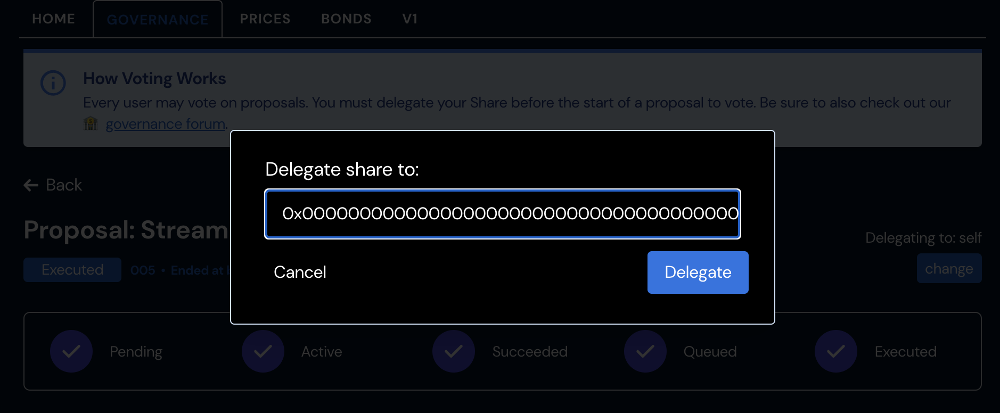
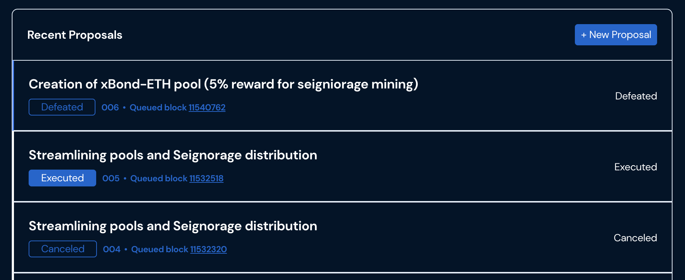
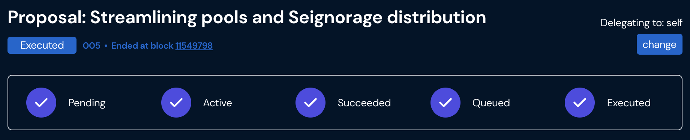

# Upgrades / Process

### Steps to Participate in On-Chain Governance

1: Delegate SHARE to yourself to another user.

2: Now you can vote for any **Active** proposal. If you have at least 210,000 SHARE \(1%\), you can also submit proposals.

3: After submitted proposal, it will take around 2 minutes to enter the UI proposals list. Users can only submit 1 proposal at a time. Each proposal will have a voting period of 17280 blocks \(~ 3 days\). If this passed quorum \(currently 20%\), the proposal enters a queuing stage.

During the queuing stage, a link will pop up in the detailed proposal UI that says **"Queue Proposal Now".** Any user can click it to queue the successful proposal on-chain.

4: Once a proposal is queued, there is a time-delay. This time delay is current to exactly 3 days \(259200 seconds\). It can be modified via governance to be a minimum of 172801 seconds \(~2 days\) or a maximum of 14 days \(1209600 seconds\). During this time-delay period, any users who disagree with the proposal can potentially exit the protocol. A guardian may also step in here or earlier to cancel the vote if there is a hostile takeover attempt.

During this time-delay period, the detailed proposal UI will display an **"ETA to execution"**, or merging the new changes into the live contracts.

5: Once the ETA has been met, a link pops up called **"✅ Execute Proposal Now"**. Any user can now sign this transaction to merge the new changes.

6: For more involved upgrades, such as protocol layer proxy-implementation amendments, users **MUST** verify the code and provide a pull request to the main GitHub. Substantial logic changes will require an audit, as enforced by the guardian. See sections below for more information.

### Voting Requirements

In order to ensure the governance process isn't gamed there are a number of required thresholds for a vote to meet before it can be implemented. These are the following parameters when voting on chain:

* **Proposal threshold:** 1% ownership or delegated ownership of SHARE \(210,000 tokens\)
* **Vote length:** A vote lasts for 17280 blocks \(roughly 3 days\)
* **Minimum Quorum:** 20% of the delegated SHARE must vote in the affirmative
* **Queue:** Successful votes will undergo a timelock delay before execution, currently set at 259200 seconds. This can be modified by governance and set to a minimum of 2 days and a maximum of 14

### Protocol Upgrades

To propose a protocol level upgrade \(to proxy-admin and admin-upgradeability\), a user must:

* [ ] Deploy new contract implementation
* [ ] Verify the source code on Etherscan
* [ ] Submit a PR to the Dollar Protocol Github with a link to the proposal and verified contracts
* [ ] Include a completed audit \(if the change is substantial\). This will be determined by Governance Guardian and community

Any protocol level upgrade that does not meet these requirements will be cancelled by the Guardian.

