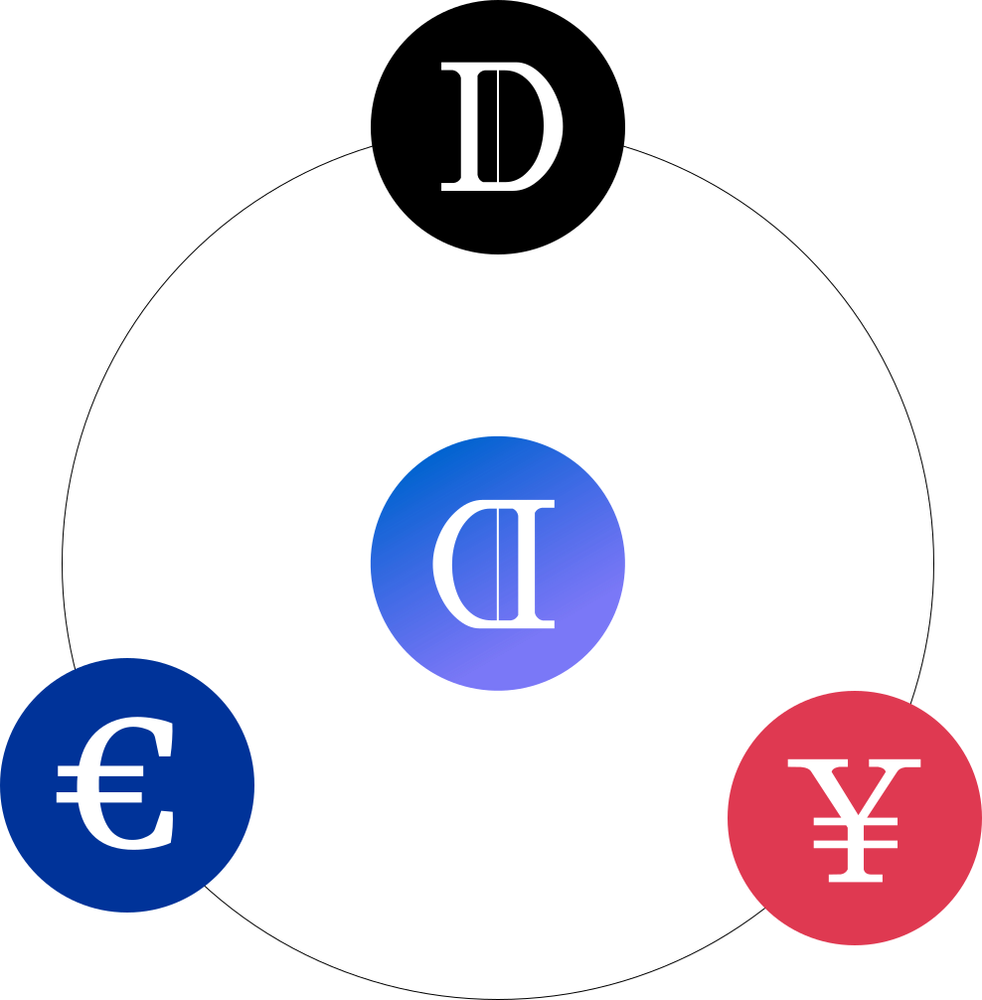

# Overview

## What is Dollar Protocol?

Dollar Protocol is a suite of decentralized algorithmic synthetic assets \(USD, EUR, YUAN\) that are governed by Share holders. 

These represent the first of many synthetic assets to be offered in a 100% non-custodial, algorithmic fashion. Each synthetic asset stands as its own unique ecosystem, with different parameters, incentives, and end goals. Each asset is to be governed solely by Share token holders, who earn seigniorage profits from each ecosystem succeeding.

While there 3 announced synthetic assets right now, there could theoretically be an infinite number, pegged to values of gold, silver, ETFs, and more.

Governance is conducted on-chain in a decentralized fashion. Read our announcement on [Seigniorage Governor Alpha](https://dollarprotocol.medium.com/introducing-seigniorage-governor-alpha-e14c189993ab).

## How does Dollar Protocol Stabilize?

Dollar Protocol uses a unique system of 100% fungible assets to achieve stability. At its core, Dollar Protocol centers around a decentralized oracle. For our $USD stablecoin, **USDx**, we use the UniswapV2 USDC-ETH oracle to determine $1's value.

### **Key Tokens**

**1: USDx \(object of stabilization\)**

USDx is pegged to the $USD price oracle. USDx is pegged to UniswapV2 oracle via a 12H TWAP. Other ecosystem tokens such as EUR or YUAN may potentially use oracles like ChainLink if there isn't a native asset to peg around.

When USDx &gt; 1.05, new USDx is minted to stakeholders. When USDx &lt; 0.95, existing non-bonded USDx is subtracted from each wallet holding USDx pro-rata.

**2: SHARE**

SHARE holders receive seigniorage profits from USDx and other tokens when they exceed the pegged value.

**3: xBond**

xBond serves as a fungible ERC-20 coupon-like instrument that pays seigniorage profits every positive rebase. xBonds never expire, but can be diluted. Please read about xBonds in detail [here](https://docs.dollarprotocol.com/stabilization/xbond) before minting or redeeming.

