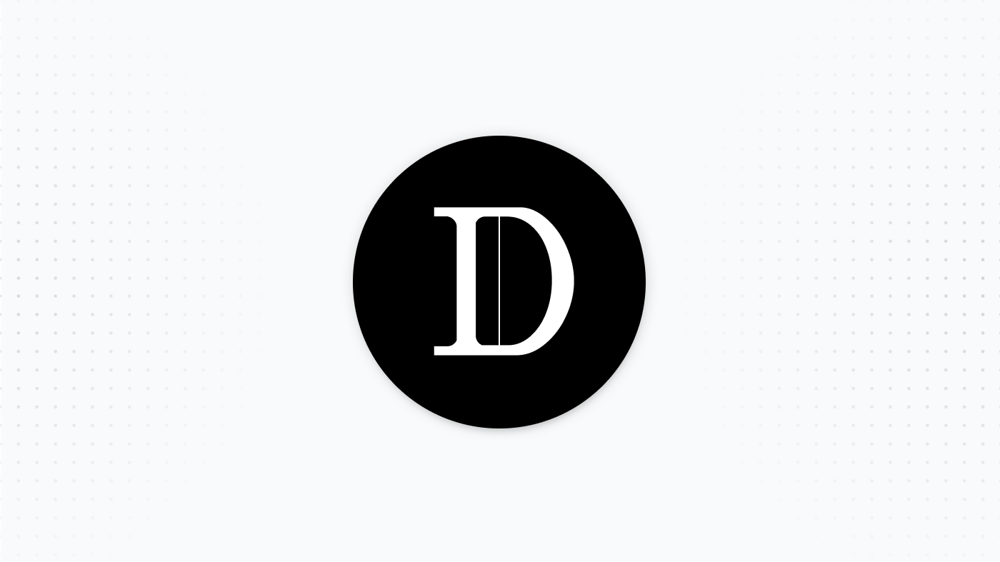

# USDx

## **Overview**

**USDx** is the object of stabilization for the USD synthetic asset in Dollar Protocol.

* USDx Contract: [0x2f6081e3552b1c86ce4479b80062a1dda8ef23e3](https://etherscan.io/address/0x2f6081e3552b1c86ce4479b80062a1dda8ef23e3)
* USDx/USDC 12H TWAP Oracle: [0x54e8fccc1f6789b1ad36eb96713c6836a1f02a4c](https://etherscan.io/address/0x54e8fccc1f6789b1ad36eb96713c6836a1f02a4c#code)

When USDx is trading &gt; $1.05 according to the 12H TWAP, a supply delta is calculated.

$$
Δ = (x_{12H} - cpi) * TS / r_{lag}
$$

* **x\_12H** represents the 12H TWAP price of USDx
* **TS** represents the total supply of USDx
* **CPI** represents the price index of the pegged assets. In this case it is USD
* **r\_lag** represents the rebase lag, a governance parameter that serves as a smoothing factor to decrease supply-side volatility

### Positive Rebase

Let's take the following example of a **positive rebase**.

* x\_12H = $1.50
* TS = 15,000,000
* CPI = $1
* r\_lag = 7

The supply delta in this case would be \(1.50 - 1.00\) \* 15,000,000 / 7 = 1,071,428.57 USDx. In this rebase period, around 1.07M USDx would be minted and distributed to protocol stakeholders.

### Negative Rebase

Conversely, let's look at an example of a **negative rebase**:

* x\_12H = $0.90
* TS = 15,000,000
* CPI = $1
* r\_lag = 7

The supply delta would be \(0.90 - 1.00\) \* 15,000,000 / 7 = 214,285.71 USDx.

If you have 1000 USDx in your wallet, un-bonded \(we will talk about this later in the xBond section\), you would see 14.28 USDx debase from your wallet, with a final balance of **985.72 USDx**.

1000 USDx / 15,000,000 total USDx \* 214,285.71 USDx = **14.28 USDx**


The USDx Debase will eventually be discontinued once the protocol matures past its bootstrapping phase. This will be explained more in the roadmap section with composability.


## Staking

USDx can earn more USDx during positive rebases by staking on our dashboard. You can visit the link [https://dollarprotocol.com/\#/stake?usdx](https://dollarprotocol.com/#/stake?usdx) to stake USDx.

Your USDx can be in 1 of 3 states.

1. Staked
2. Committed to Unstake
3. Unstaked \(i.e. free-floating\)

Important variables controlled by [Governance](https://docs.dollarprotocol.com/governance/parameters):

* Minimum Stake Period \(259200 seconds or 3 days\) 
* Minimum Cool Down Period \(129600 seconds or 1.5 days\)
* Staking Seigniorage Percentage

### Staked State

When a user stakes their USDx, that USDx is locked in the contract and earns pro-rata seigniorage. The specific percentage is determined by governance. 

### Committed to Unstaking State

The user can commit to unstaking after he has met the minimum stake period \(currently 3 days\).

Once the user has committed to unstaking, he cannot stake new USDx. During this commit period, the user must wait for the minimum cool down period \(currently 1.5 days\). After this 1.5 day period is met, the user can unstake completely and get back his principle.

### Unstaked State

By default, all USDx is unstaked. Unstaked USDx is just normal USDx that can be used to provide liquidity, exchanged/swapped and used as a form of virtual currency.

