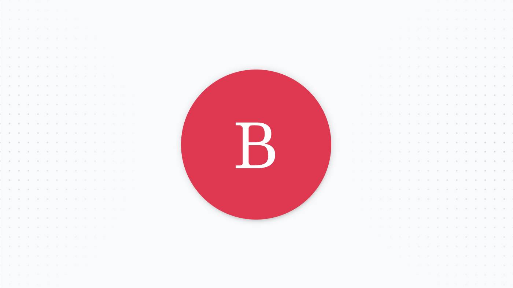
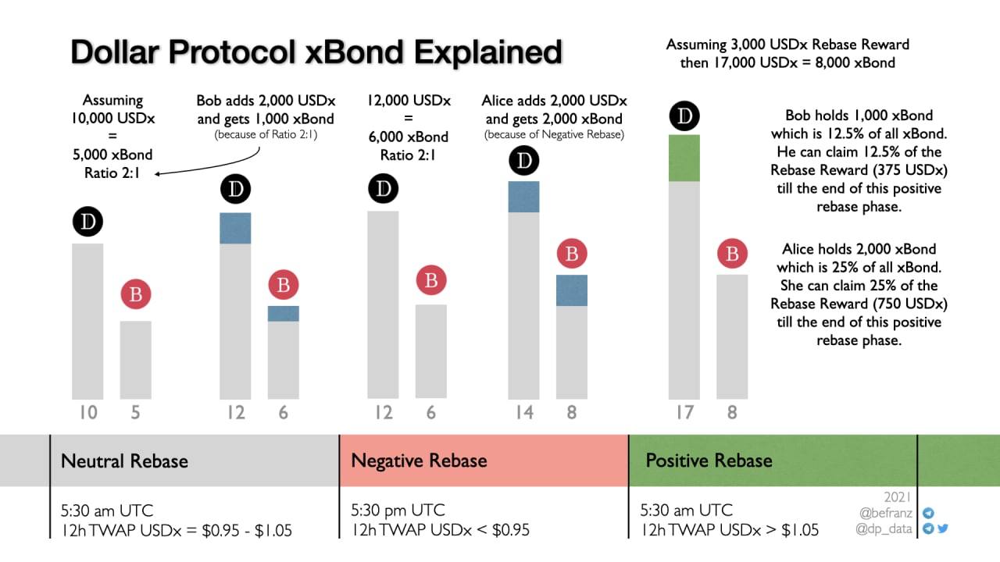

# xBond

Contract: [0xa8f8dC37f3aB1F2357eC1B6345e02798b4124DCD](https://etherscan.io/token/0xa8f8dC37f3aB1F2357eC1B6345e02798b4124DCD)

xBond is a fungible ERC-20 seigniorage bearing coupon. This coupon is unique because:

* xBond doesn't expire
* xBond serves as a type of "savings bank" if you mint during negative rebases, as your ratio never dips below 1:1
* xBond receives 40% of seigniorage during positive rebase

xBond can be minted, redeemed, and traded by anyone.

The bonding curve for xBond is a piecewise function.

1. During negative rebases, xBond mints at a 1:1 ratio with USDx \(1 USDx --&gt; 1 xBond\)
2. During positive/neutral rebases, 1 USDx = xBond Amount \* Locked USD / xBond Supply

$$
f(x) = (xBond_y * Lock_{usd}) / xBond_{supply}
$$

|  | Redeemable | Mintable | Bonding Curve |
| :--- | :--- | :--- | :--- |
| **+** Positive Rebase | Yes | Yes | **f\(x\)** |
|    Neutral Rebase | No | Yes | **f\(x\)** |
| **-** Negative Rebase | No | Yes | 1:1 |

**f\(x\)** here represents the amount of USDx redeemed or minted.


Redeeming xBonds burns xBonds and returns to you USDx according to the bonding curve


### FAQs

**What is Lock\_usd?**

Lock\_usd in the bonding curve represents the amount of USDx locked in the bonding contract. This amount of locked USDx increases when users mint xBond and decreases when users redeem xBond. The ratio between xBond and USDx in the contract changes when positive rebases occur and new USDx is sent to the bonding contract.

For example, let's assume that there are 100 USDx and 100 xBonds in the contract, denominating a 1:1 ratio. During a positive rebase, 50 new USDx is minted to the bonding contract. Now there are 150 USDx and 100 xBonds, resulting in a ratio of 3:2.

This new ratio allows for a more favorable redemption of xBonds as now 1 xBond is worth 1.50 USDx.

**Should I mint xBond during neutral or positive rebases?**

Minting xBond during positive or neutral rebases is risky as you are locking in the current USDx - xBond ratio. It would be advisable to mint if you are confident there are many consecutive postive rebases in the near future. Otherwise, it is less risky to earn USDx seigniorage from holding Share or providing liquidity. 

**Why is there no incentivized xBond trading pool?**

Currently, there is no protocol incentive \(seigniorage or otherwise\) that provides rewards for xBond trading / liquidity. This can be voted in via governance if users desire.

**Do I need to claim xBond every positive rebase?**

The xBonds that are redeemable every rebase are a function of your xBond ownership \(xBond in wallet / total xBond supply\) and the current allocated seigniorage. So if xBonds are allocated 100,000 USDx and you own 1% of xBonds, you can redeem roughly 1000 USDx worth of xBonds, given the current bonding curve ratio. 

If you do not redeem, the USDx accumulate and help maintain the current xBond to USDx ratio. However, you cannot claim these USDx in the future, as they are now are part of the bonded assets. From a game-theoretical approach, redeeming xBond gives users an option to cash out while letting USDx rewards accrue solidifies your xBond position and value. This is because your xBonds are directly proportional to the amount of USDx in the bonding curve.

