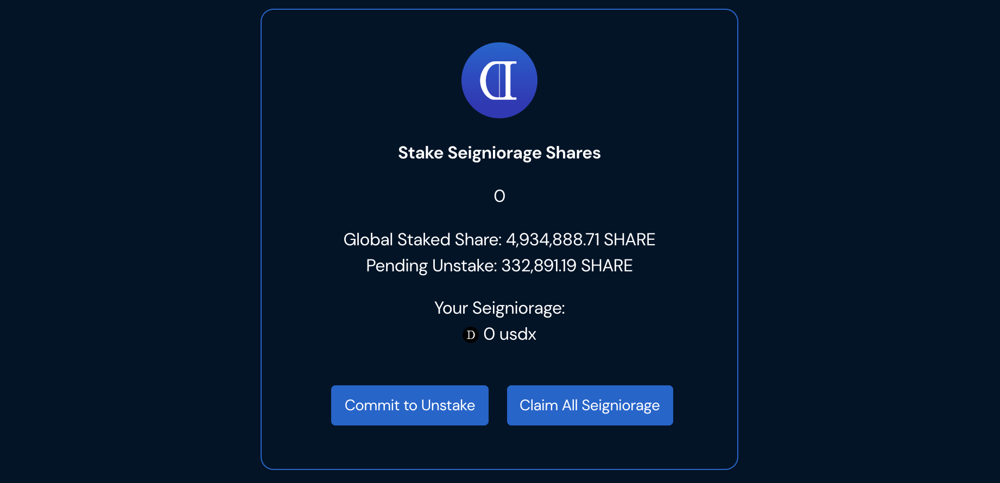

# Share

Share represents the governance token over the Dollar Protocol and subsequent synthetic ecosystems. It has the power to make proposals, delegate votes and vote, pass and execute protocol level amendments.

### Staking

NOTE: Staking will go live on 1/4/2020 5pm UTC. Be sure to stake your SHARE beforehand using the UI at [https://dollarprotocol.com/\#/stake](https://dollarprotocol.com/#/stake) so you are ready for the rewards.


Staking Share is binary; a wallet is either fully staked or not. This is because staked Share remains in a user's wallet instead of being sent to another contract. Keeping share in a user's wallets allows them to delegate and vote share, which is important. If you would like to have free-floating Share to trade, it is advisable to either unstake, or use a separate unstaked wallet.


Staking SHARE is a new governance proposal that passed recently. This proposal will give seigniorage profits for SHARE only to staked SHARE. 

The reward payout will still be pro-rata. Specifically, it will use the total staked share as the pro-rata denominator. This means that if 10M Share are staked, your pro-rata ownership of the seigniorage would be X / 10M. Unstaked Share will receive 0 seigniorage.

Unstaking Share is a 2 step process.

1. Commit to unstake \(1.5 days\). During this 1.5 day process, you will not receive any seigniorage reward. This timelock is to encourage users to remain staked.
2. After the 1.5 day minimum has been met, users can fully unstake and start to trade, send or provide liquidity using Share.

The 1.5 day minimum is also a governance parameter.

* Staking Share locks any Share in your own wallet. If other users send you Share, it is automatically added to your Stake
* Staked Share still has the ability to delegate and vote

### Claiming

To claim your seigniorage, you can either:

1: Click "Claim All Seigniorage"

2: Perform a state change operation using USDx or Share. For example, sending yourself 0 USDx or buying Share from an exchange.

If you notice "Your Seigniorage" goes down to 0, your seigniorage must have been auto-claimed by the state change operation. Be sure to check incoming seigniorage transactions to your account from the [minter address](https://etherscan.io/address/0x0000000000000000000000000000000000000000), [0x0000000000000000000000000000000000000000](https://etherscan.io/address/0x0000000000000000000000000000000000000000).

### FAQs

**Why do I get a "The transaction can not succeed. Error undefined." error while trading on Uniswap?**

Your wallet is staked and thus cannot trade Share tokens. Please consider unstaking or using a different unstaked wallet.

**Why doesn't Staking Share send it to another contract?**

The biggest reason why staking Shares isn't sent to another contract is that it will complicate the delegating / voting process. Staking's main benefit is that it causes Shares to be more scarce, as well as protecting against users who buy Shares just for gaming positive rebase periods for 15 minutes at a time.

In this sense, staking is more akin to locking.

